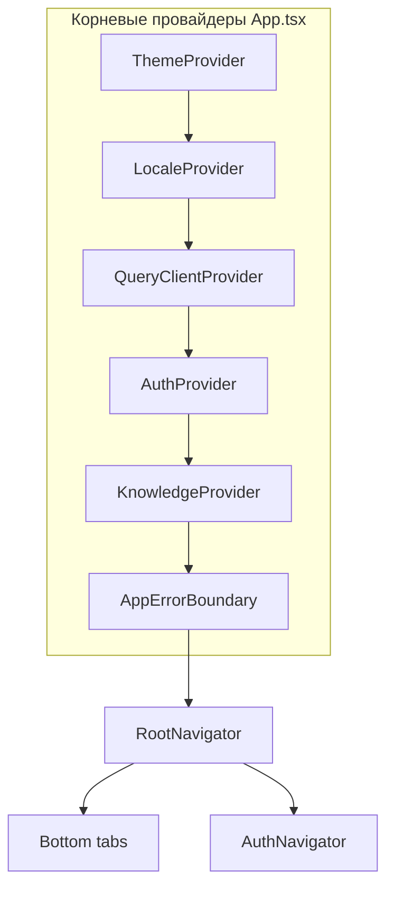

# BBplay — архитектура и инструменты

## Назначение

Клиентское приложение для сети **BlackBears Play**: вход и регистрация на бэкенде **`vibe.blackbearsplay.ru`** (и связанных iCafe-эндпоинтах), список клубов, новости (VK / парсинг стены), бронирование ПК, напоминания и обратная связь по визитам, локальный чат поддержки по JSON-базе знаний. Серверная бизнес-логика — на стороне API; приложение — тонкий клиент.

## Стек и библиотеки

| Область | Технология |
|--------|------------|
| Платформа | **Expo SDK 51** (React Native 0.74, React 18), TypeScript |
| Навигация | `@react-navigation/native`, bottom tabs + стеки (профиль, авторизация) |
| Серверное состояние | `@tanstack/react-query` (в `App.tsx` отключён `refetchOnWindowFocus`, чтобы не сбрасывать ввод при клавиатуре на RN) |
| Персистентность кэша | Зависимости `@tanstack/react-query-persist-client`, `@tanstack/query-async-storage-persister`, `@react-native-async-storage/async-storage` установлены; черновой конфиг и отбор ключей — в [`src/query/queryClient.ts`](../src/query/queryClient.ts). В корне сейчас используется обычный `QueryClientProvider` из [`App.tsx`](../App.tsx) (без `PersistQueryClientProvider`), то есть **дисковый персист в рантайме не подключён**. |
| Навигация (натив) | `react-native-screens`, `react-native-safe-area-context`, `react-native-gesture-handler` |
| UI-ввод даты/времени | `@react-native-community/datetimepicker` |
| Шрифты | `expo-font` + локальные OTF в `assets/fonts/` |
| HTTP / API | Слой [`src/api/vibeClient.ts`](../src/api/vibeClient.ts) и узкие модули [`icafeClient.ts`](../src/api/icafeClient.ts), нормализаторы ответов, [`client.ts`](../src/api/client.ts) (`ApiError`) |
| Сессия | [`src/auth/sessionStorage.ts`](../src/auth/sessionStorage.ts) — данные сессии в `expo-secure-store` |
| Подписи запросов | `md5`, `expo-crypto` — ключи/подписи для verify/booking (см. `bookingSignConfig`, `verifyKey`) |
| Локализация | [`src/i18n/`](../src/i18n/) — `LocaleContext`, сообщения `messagesEn` / `messagesRu` |
| Тема и типографика | [`src/theme/`](../src/theme/) — палитры, шрифты Expo, `ThemeProvider` |
| Уведомления | `expo-notifications` — напоминания о брони, синхронизация с данными броней ([`TodayBookingNotificationSync`](../src/navigation/TodayBookingNotificationSync.tsx), [`bookingReminders`](../src/notifications/bookingReminders.ts)) |
| Календарь устройства | `expo-calendar` — опциональное добавление брони в календарь ([`deviceCalendar`](../src/calendar/deviceCalendar.ts)) |
| Геолокация | `expo-location` — сортировка клубов по расстоянию |
| WebView | `react-native-webview` — внешние страницы (новости VK, оплата и т.д.) |
| Прочее Expo | `expo-clipboard`, `expo-constants`, `expo-device`, `expo-haptics`, `expo-linear-gradient`, `expo-splash-screen`, `expo-status-bar` |
| Web (опционально) | `react-native-web`, `@expo/metro-runtime` — таргет `expo start --web` |
| Патчи зависимостей | `patch-package` (скрипт `postinstall`) — см. каталог [`patches/`](../patches/) |
| Сборка / язык | TypeScript ~5.3, Babel (`@babel/core`), Metro через Expo |
| Тесты | `vitest` — `tests/unit`, `tests/api-live` |

Конфигурация приложения и переменные окружения: [`app.config.js`](../app.config.js), см. также [`.env.example`](../.env.example).

## Структура приложения (высокий уровень)



- **`AuthContext`** — состояние входа, сессия, выход.
- **`KnowledgeContext`** — загрузка базы знаний (локальный JSON и/или URL из `extra.knowledgeJsonUrl`).
- **`RootNavigator`** — по авторизации показывает либо `AuthNavigator`, либо основные вкладки; deep linking `bbplay://`; обёртки уведомлений и фидбэка по визитам (`VisitFeedbackProvider`, `TodayBookingNotificationSync`, `BookingNotificationListener`).
- **`useAppBootstrap`** ([`src/query/useAppBootstrap.ts`](../src/query/useAppBootstrap.ts)) — стартовая подгрузка кафе, новостей VK, данных бронирования после готовности auth и базы знаний; до завершения показывается загрузка.

## Основные экраны и фичи

| Область | Путь | Суть |
|--------|------|------|
| Профиль | `src/features/profile/` | Профиль, баланс, настройки, внешний вид, напоминания, инсайты (WebView/API) |
| Авторизация | `src/features/auth/` | Логин, регистрация, верификация |
| Клубы | `src/features/cafes/` | Список клубов, карта зала (`ClubLayoutCanvas`, `HallMapPanel`, геометрия раскладки) |
| Новости | `src/features/news/` | VK-стена / видео, модалки |
| Бронь | `src/features/booking/` | Тарифы, живые ПК, создание брони, баннер «сегодня», утилиты времени |
| Чат | `src/features/chat/` | Поиск по базе знаний без вызова внешних LLM |
| Уведомления | `src/notifications/` | Напоминания, отзыв после визита, отбор pending feedback |

Подробнее по контрактам API: [`docs/api-spec.md`](api-spec.md), [`docs/icafe-api.md`](icafe-api.md), [`docs/API_VIBE_LOGIC.md`](API_VIBE_LOGIC.md).

## Поток данных (упрощённо)

1. **Логин / регистрация** — запросы к vibe/iCafe, сохранение сессии и токенов при необходимости.
2. **Клубы и бронь** — `GET` списков, `POST /booking` с подписью; брони пользователя — пути из конфига (`allBooksPath` и др.).
3. **Чат** — только локальный поиск по структурированной базе (`assets/knowledge.json` или удалённый JSON); **без** обращения к облачным LLM из приложения.

## Подходы к разработке

- **Типизированный клиент API** с единым разбором ответов и ошибок.
- **Фичи по папкам** (`features/<area>/`) + общие `api/`, `navigation/`, `theme/`, `i18n/`.
- **Разделение** UI, запросов (React Query), и чистых утилит (время, геометрия зала, нормализация API).
- **Ошибки UI** — граница `AppErrorBoundary` на корне навигации.
- **Патчи** — изменения в `node_modules` фиксируются через `patch-package`, чтобы сборки были воспроизводимыми.

## AI-инструменты

| Инструмент | Роль |
|------------|------|
| **Cursor** (Agent / Composer) | Основная среда: генерация и правка кода, рефакторинг, документация. |
| Модели в Cursor | Зависят от тарифа/настроек Cursor (конкретная модель в репозитории не фиксируется). |

Полный перечень **промптов пользователя к Cursor Agent** — в [`PROMPTS_ALL.md`](PROMPTS_ALL.md) (генерация: `npm run export:cursor-prompts` и `npm run docs:prompts-md`). Краткое оглавление и ручные дополнения — в [`PROMPTS.md`](PROMPTS.md).

Приложение **не** встраивает API-ключи сторонних LLM для пользовательского чата: «бот поддержки» работает на **локальной** базе знаний.

## Сборка APK / iOS (EAS)

Конфигурация — [`eas.json`](../eas.json):

| Профиль | Назначение |
|---------|------------|
| `development` | development client, `distribution: internal` |
| `preview` | внутренняя раздача; **Android: APK** (`buildType: apk`); iOS без симулятора |
| `production` | **Android: AAB** (Google Play) |

Типовой сценарий:

```bash
npm install
npm install -g eas-cli
eas login
eas build -p android --profile preview
```

Локально без EAS (нужны Android Studio / Xcode):

```bash
npx expo prebuild
npx expo run:android
npx expo run:ios
```

`extra.eas.projectId`, bundle id и разрешения — в [`app.config.js`](../app.config.js).

| Платформа | Тип | Ссылка на артефакт |
|-----------|-----|---------------------|
| Android | APK (preview) / AAB (production) | _вставить после `eas build`_ |
| iOS | ipa / TestFlight | _вставить после `eas build`_ |
