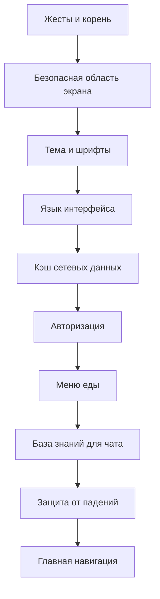

# Как устроено приложение BBplay

Этот текст для того, кто хочет **понять устройство проекта словами**, без погружения в каждый файл. Точные версии библиотек, команды сборки и таблицы стека лежат в [`ARCHITECTURE.md`](ARCHITECTURE.md); договорённости с сервером — в [`api-spec.md`](api-spec.md) и соседних документах по API.

---

## Что это за программа

**BBplay** — мобильное приложение для сети компьютерных клубов **BlackBears Play**. Пользователь видит клубы, новости, может забронировать ПК, посмотреть меню, почитать акции и написать в чат поддержки. Вход, баланс, брони и «истина» по тарифам живут на **сервере** (в первую очередь `vibe.blackbearsplay.ru` и связанные сервисы). Само приложение по сути **показывает данные и отправляет запросы**: сложная бизнес-логика остаётся на бэкенде.

---

## На чём оно написано (одним абзацем)

Проект собран на **Expo** и **React Native**: один код на Android и iOS, язык **TypeScript**. Интерфейс строится из экранов и компонентов React; переходы между экранами — через **React Navigation** (внизу вкладки, внутри профиля — отдельные «стопки» экранов). Данные с сервера кэшируются через **TanStack React Query**: повторные заходы на экран не дёргают сеть без нужды, часть кэша при перезапуске приложения **сохраняется на устройстве** (клубы, схема залов, лента новостей — с ограничением по времени). Сессия и чувствительные вещи хранятся **в защищённом хранилище** устройства. Тема оформления и язык (русский / английский) задаются своими обёртками вокруг всего дерева экранов.

Если нужна «карта железа»: уведомления, календарь, геолокация, камера и WebView подключаются там, где сценарий это требует (напоминание о брони, клубы по расстоянию, QR или фото в профиле, оплата во внешней странице).

---

## С чего начинается запуск приложения

При старте включается цепочка обёрток (снаружи — внутрь): жесты и безопасные отступы экрана, **тема** и шрифты, **язык**, затем **кэш запросов** и **авторизация**. Параллельно подключаются контексты **меню (еда)** и **базы знаний для чата**. Поверх всего висит **ловец ошибок**, чтобы сбой в одном экране не «убил» всё приложение без сообщения. Внутри этой цепочки уже рисуется главный навигатор: либо экраны входа и регистрации, либо основные вкладки.

Смысл такого порядка простой: сначала готовятся «правила мира» (как выглядит интерфейс, на каком языке говорим, есть ли сессия и справочники), и только потом показываются конкретные экраны.

---

## Как пользователь ходит по приложению

Пока человек **не вошёл в аккаунт**, он видит только поток **авторизации** (логин, регистрация, подтверждение).

После входа открываются **нижние вкладки**: профиль (с вложенными экранами вроде настроек и новостей), клубы, еда, бронирование и чат. Рядом с основным интерфейсом работают вещи вроде **напоминаний о брони** и **запроса отзыва после визита**: они не «экраны», а фоновая логика, привязанная к данным бронирований.

Приложение умеет открывать разделы по **ссылке вида `bbplay://`** — это удобно для кнопок из пушей или внешних страниц.

При первом входе в основную часть приложение **догружает** список клубов, новости и сведения о бронях; пока критичные данные не готовы, пользователь может видеть состояние загрузки (есть ограничение по времени ожидания, чтобы не зависнуть при плохой сети).

---

## Как в коде разложены части проекта

Папка **`src/features`** — это **крупные смысловые куски продукта**, каждый со своими экранами и логикой:

- **auth** — вход и регистрация.  
- **profile** — профиль, настройки, внешний вид, город, напоминания, сценарии с QR и лицом, внешние «инсайты» через WebView там, где нужно.  
- **cafes** — список клубов и **визуальная карта зала**: где стоят ПК, какие зоны, какие машины заняты.  
- **news** — лента новостей в духе стены VK, в том числе видео.  
- **booking** — выбор клуба, времени, тарифа, работа с «живым» списком ПК, отмена брони, напоминания про сегодняшнюю сессию.  
- **food** — меню и сценарии, связанные с едой в клубе.  
- **promos** — акции, красивые карточки, промо с **трёхмерными костями** как отдельный визуальный ход.  
- **chat** — поддержка: ответы из **базы знаний**; при настройке ключа к облаку **Ollama** доступен режим ответов «как у нейросети», но опирающийся на ту же базу (и вспомогательный разбор текста про бронь).

Отдельно от «фич» лежат слои **общего назначения**:

- **`src/api`** — всё, что ходит по HTTP к вашим серверам: единый стиль запросов и ошибок.  
- **`src/auth`** — кто сейчас пользователь и жива ли сессия.  
- **`src/knowledge`** — откуда берётся база знаний для чата (файл в приложении и/или адрес JSON в настройках сборки).  
- **`src/ai`** — необязательная часть про **Ollama** (ответы с опорой на базу и разбор фраз про бронь).  
- **`src/navigation`** — связка экранов и вкладок.  
- **`src/notifications`**, **`src/calendar`** — напоминания и запись в календарь телефона.  
- **`src/theme`**, **`src/i18n`**, **`src/components`** — внешний вид, переводы, переиспользуемые куски интерфейса.  
- **`src/query`** — настройка кэша, ключи запросов, стартовая подгрузка при открытии приложения.

Такое разделение помогает не смешивать «как рисуем бронь» и «как шлём байты на сервер»: API и экраны связаны, но живут в разных местах.

---

## Откуда берутся данные и куда уходят запросы

**Авторизация и профиль** говорят с основным API сети; часть сценариев регистрации может идти через отдельный хост iCafe, если так задано в конфиге.

**Клубы и схема зала** приходят с сервера; приложение **рисует** зал и расставляет ПК по правилам, которые заложены в коде (геометрия, зоны), а **занятость** подтягивается как актуальное состояние.

**Бронирование** читает тарифы и список машин, а при создании брони отправляет на сервер подписанный запрос (чтобы подделать бронь «с улицы» было сложнее). Секрет для подписи задаётся при сборке, а не вводится пользователем.

**Новости** тянут контент из связки с VK; часть данных может жить в кэше, чтобы лента открывалась быстрее.

**Чат** в базовом варианте **не обязан** ходить в интернет за ответом: достаточно локальной копии базы знаний. Если в сборке указан ключ к Ollama и пользователь выбрал «нейросеть», ответы строятся через облако, но **с опорой на ту же базу**, а не «с пустого листа».

---

## Где смотреть настройки окружения

Главный файл конфигурации Expo — **`app.config.js`**: адрес API, пути для списка броней, ссылка на JSON базы знаний, ссылки на оплату и формы, параметры Ollama. Для разработчика список переменных окружения продублирован в **`.env.example`**.

---

## Что почитать дальше

- **Фишки продукта глазами пользователя** — отдельный файл [`PROJECT_FEATURES.md`](PROJECT_FEATURES.md).  
- **Таблицы стека, EAS, тесты** — [`ARCHITECTURE.md`](ARCHITECTURE.md).  
- **Подробное оглавление документации** — [`docs/docs/README.md`](docs/docs/README.md).

Схема провайдеров «как в коде» (если удобнее картинкой, чем списком выше):

Рекомендую обратить внимания, на привязку сторонних сервисов, акции, путеводители при первом входе.
Логин чере qr код и добавление лица в профиль, через которое в последствии можно будет свою личность подтверждать через камеру в клубах.
Заказ еды, и помощь через базу знаний(оффлайн) и нейрость (онлайн).
Так же на бронь через чат, и экран брони.
Так же на новости для разных регионов и подстройку времени под 24 часа и 12 часов