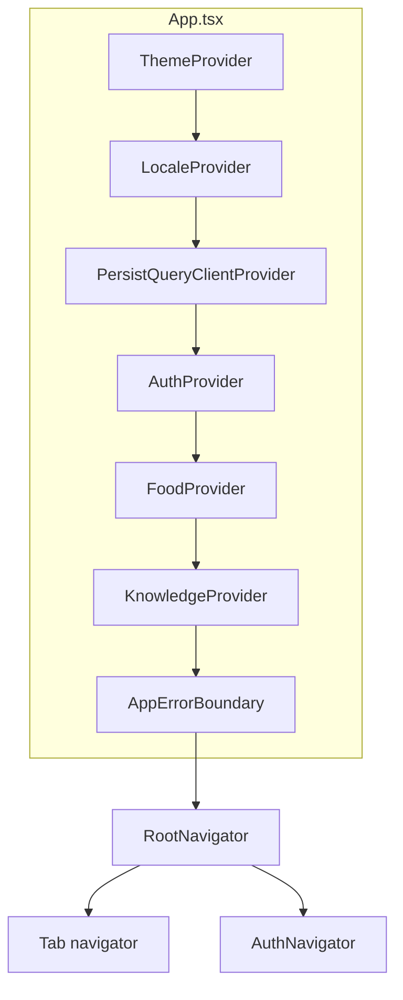

# Архитектура

## Назначение

**bbplay** — клиент **Expo SDK 51** (React Native 0.74, TypeScript) для сети BlackBears Play. Данные пользователя, клубы, брони и биллинг приходят с **vibe** (`vibe.blackbearsplay.ru` и родственные пути) и **iCafe v2** через прокси; приложение не дублирует серверную бизнес-логику.

## Обзор компонентов

| Компонент | Роль |
|-----------|------|
| `App.tsx` | Шрифты Expo, splash, `Audio` режим, обёртка жестов и safe area |
| `ThemeProvider` | Светлая/тёмная тема, типографика |
| `LocaleProvider` | Язык UI (`ru` / `en`) |
| `PersistQueryClientProvider` | React Query + персист **части** кэша в AsyncStorage (см. [data-and-jobs.md](data-and-jobs.md)) |
| `AuthProvider` | Сессия, логин/логаут, токены |
| `FoodProvider` | Данные по еде, если используются сценарии с меню |
| `KnowledgeProvider` | Загрузка базы знаний (локальный JSON и/или URL из `app.config` `extra`) |
| `AppErrorBoundary` | Отлов ошибок рендера в дереве навигации |
| `RootNavigator` | Ветвление: не авторизован → стек auth; иначе табы (клубы, бронь, …) + deep link `bbplay://` |

| Область | Каталог | Суть |
|---------|---------|------|
| Профиль | `features/profile/` | Профиль, баланс, настройки, инсайты |
| Auth | `features/auth/` | Вход, регистрация, verify SMS |
| Клубы | `features/cafes/` | Список, сортировка по гео, схема зала |
| Новости | `features/news/` | VK wall / WebView |
| Бронь | `features/booking/` | Тарифы, ПК, создание/отмена, баннеры |
| Чат | `features/chat/` | Поиск по `knowledge.json`, без LLM |
| API | `api/` | Унифицированные запросы и нормализация |

## Старт приложения

`useAppBootstrap` подтягивает кафе, новости, брони после готовности auth и knowledge; до завершения — экран загрузки.

## Термины

- **Vibe** — прикладной бэкенд BlackBears (хост и пути из `EXPO_PUBLIC_API_BASE_URL` и `src/config/vibePaths.ts`).
- **iCafe** — API клубного ПО; клиент строит пути через `icafeClient` / конфиг.
- **Member** — пользователь в системе iCafe после логина; `member_id`, `private_key` и т.д. в сессии.
- **Бронь** — создание через POST с **подписью** (`bookingKey`, режимы в `.env`); список — отдельные GET из конфига.

## С чем не путать

- **Персист React Query** — не замена офлайн-режима: в AsyncStorage кладутся только выбранные query keys (`cafes`, `struct-rooms`, `vk-wall`).
- **Чат поддержки** — не облачный бот: только локальный/загруженный JSON.

См. также: [../ARCHITECTURE.md](../ARCHITECTURE.md), [../modules-map.md](../modules-map.md).
